# Lab 4. Run EasyOCR library on AWS Panorama

> **Warning:** Make sure you have performed the steps described in the Prerequisites section before beginning this lab.

## Overview

This lab is an advanced example which will walk a user through step-by-step instructions on how to directly leverage the GPU on the AWS Panorama device and deploy an Optical Character Recognition model that uses EasyOCR PyTorch Model. By completing this Lab, in addition to what you learnt in Labs 1 and 2, you will learn
* How to bring your own pre-trained OCR model to run on the Panorama device
* Using PyTorch models in general on Panorama

**Test Utility** Unlike Lab1 and Lab2, this app does not fully use the Test Utility. It uses it to build and deploy the application but not test the application. 

**panorama-cli** is a command-line utility to help Panorama application developers construct necessary components such as code node, model node, camera node, node packages, container image for code, and node graph structure. It also helps uploading packages to AWS Cloud before deploying application to the device. For more details about panorama-cli, please refer to [this page](https://github.com/aws/aws-panorama-cli).

## How to open and run notebook

This Lab uses SageMaker Notebook environment. 
1. Visit [SageMaker Notebooks instances page](https://console.aws.amazon.com/sagemaker/home#/notebook-instances) and find "PanoramaWorkshop". Click "Open JupyterLab". 
1. In the file browser pane in left hand side, locate "aws-panorama-immersion-day" >  "labs" > "3. lab4.ipynb", and double click it. Notebook opens.
1. Select the first cell, and hit Shift-Enter key to execute a single selected cell and move to next cell.


## Download Artifacts

1. Open a terminal again and run aws configure. Enter your Access credentials here. Once you enter them and click enter, close the terminal

      


2. Open the included lab4.ipynb notebook. Hit **Shift-Enter**, and execute the first code cell **"Set Up"**. This cell imports necessarily Python modules for this Lab.
    ``` python
        import sys
        import os
        import time
        import json

        import boto3
        import sagemaker

        import matplotlib.pyplot as plt
        from IPython.core.magic import register_cell_magic

        sys.path.insert( 0, os.path.abspath( "../common/test_utility" ) )
        import panorama_test_utility

        # instantiate boto3 clients
        s3_client = boto3.client('s3')
        panorama_client = boto3.client('panorama', region_name = 'us-west-2')  
    ```

3. Create Notebook Parameters next (**Shift-Enter**)

    ``` python
        # application name
        app_name = 'lab4'

        ## package names and node names
        code_package_name = 'lab4'
        camera_node_name = 'abstract_rtsp_media_source'

        # AWS account ID
        account_id = boto3.client("sts").get_caller_identity()["Account"]
    ```
    
4. Once we create the above parameters, we now replace the account id's / import our application. (**Shift-Enter**)

    ``` python
    !cd ./lab4 && panorama-cli-dev import-application
    ```
    
5. At this point we can start downloading the dependencies (Base Docker file) and the source code. Run this cell with **Shift-Enter**


    ``` python
    panorama_test_utility.download_artifacts_gpu_sample('tensorrt', account_id)
    ```

## Preparation

1. The first step here is to build the base docker image. For that, open a terminal session by clicking on the blue + button on the left

      

2. Once you click it, a screen with multiple options will open like below. Click **Terminal** option in the Other section

      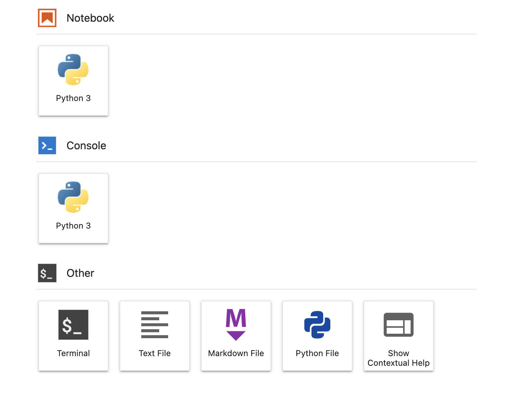

3. After clicking terminal, you should see a terminal open up like here. 

      


4. In the terminal, type the following

    ```
    cd aws-panorama-immersion-day/labs/TensorRT/dependencies/docker
    ```


5. Once you get to the folder called dependencies, type the following 

    ```sudo docker build -t  pt:37 .```

> **Warning:** : This will take a bit of time and should take upwards of 30 mins.


Once we are done with Step 5, we are ready to build the application

## Create Camera

1. Once you are done building the base docker file, come back to the ipython notebook.Go to section, **Update Camera Streams**

2. In this step we are creating a new camera for you to use. 
> **Warning:** : You should already have an RTSP camera connected to the same subnet as the device

    ``` python
    CAMERA_NAME = "test_rtsp_camera_lab4"

    CAMERA_CREDS = '{"Username":"root","Password":"Aws2017!","StreamUrl": "rtsp://10.92.202.65/onvif-media/media.amp?profile=profile_1_h264&sessiontimeout=60&streamtype=unicast"}'
    ```
3. In the above step, update your username, password and the stream url of the RTSP stream you have set up

4. Run the next cell as is. This cell programatically creates your camera on the cloud

    ``` python
        res = !aws panorama create-node-from-template-job --template-type RTSP_CAMERA_STREAM \
            --output-package-name {CAMERA_NAME} \
            --output-package-version '1.0' \
            --node-name {CAMERA_NAME} \
            --template-parameters '{CAMERA_CREDS}'

        res = ''.join(res)
        print(res)
        res_json = json.loads(res)
    ```

5. Check the Status of the Camera creation in the next cell

    ``` python
    !aws panorama describe-node-from-template-job --job-id {res_json['JobId']}
    ```

## Build Application Container

1. Run cell that says the following with **Shift-Enter**

    ``` python
    container_asset_name = 'lab4'
    ```
    
    
1. Run the next cell that is building the container artifacts with **Shift-Enter**

    ``` python
    %%capture captured_output

    # Building container image.This process takes time (5min ~ 10min)
    # FIXME : without %%capture, browser tab crashes because of too much output from the command.

    !cd ./lab4 && panorama-cli build \
        --container-asset-name {container_asset_name} \
        --package-path packages/{account_id}-{code_package_name}-1.0

    ```
    
1. Run the next cell simulataneously, this essentially gives you the status once the above cell runs. Run with **Shift-Enter**

    ``` python
    stdout_lines = captured_output.stdout.splitlines()
    stderr_lines = captured_output.stderr.splitlines()
    print("     :")
    print("     :")
    for line in stdout_lines[-30:] + stderr_lines[-30:]:
        print(line)
    ```
    
1. Once the above cells finish building the container artifacts, go to 

    ``` python
    ./lab4/packages/<accountnum>-lab4-1.0/package.json
    ```

1. Right Click on package.json and open with Editor
    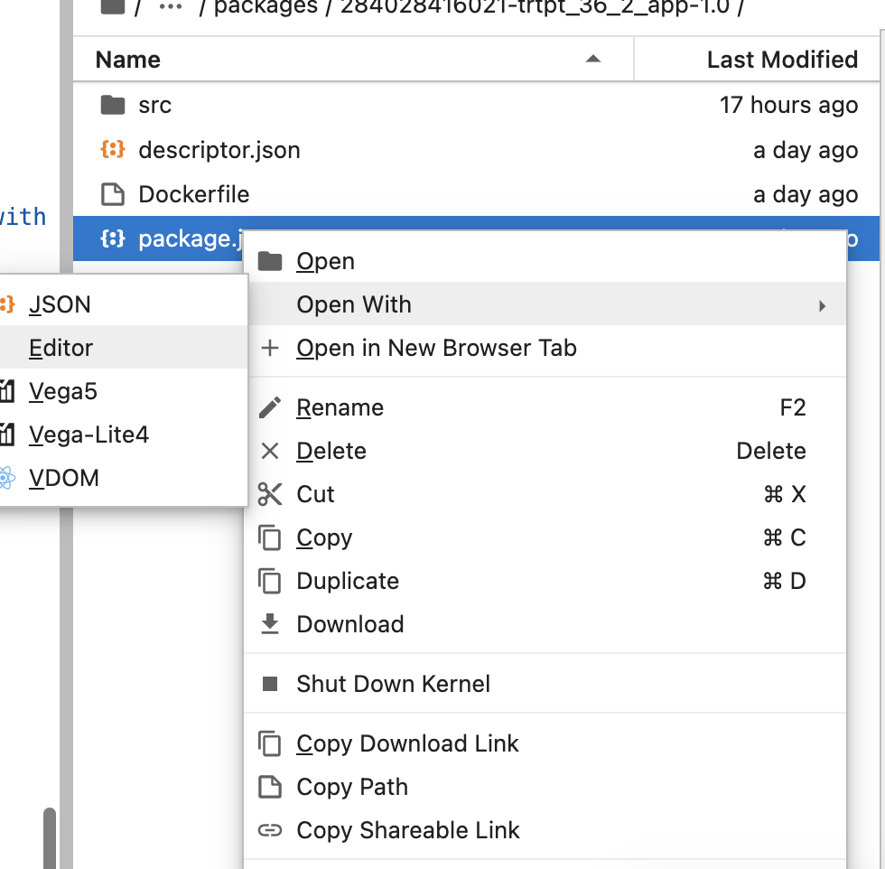
    
1. Once it opens with the editor, add the following to the file

   ``` python
        "requirements": 
                    [{
                            "type" : "hardware_access",
                            "inferenceAccelerators": [ 
                                {
                                    "deviceType": "nvhost_gpu",
                                    "sharedResourcePolicy": {
                                        "policy" : "allow_all"
                                    }
                                }
                            ]
                    }]
    ```
    
    The assets section should look something like this after

   ``` python
            "assets": [
            {
                "name": "lab4",
                "implementations": [
                    {
                        "type": "container",
                        "assetUri": "9a49a98784f4571adacc417f00942dac7ef2e34686eef21dca9fcb7f4b7ffd70.tar.gz",
                        "descriptorUri": "4bab130ec48eea84e072d9fe813b947e9d9610b2924099036b0165026a91d306.json",
                        "requirements": 
                        [{
                            "type" : "hardware_access",
                            "inferenceAccelerators": [ 
                                {
                                    "deviceType": "nvhost_gpu",
                                    "sharedResourcePolicy": {
                                        "policy" : "allow_all"
                                    }
                                }
                            ]
                        }]
                    }
                ]
            }
        ],    
    ```
    
1. At this point, we are ready to upload the application. Execute this cell with **Shift+Enter**

   ``` python
        !cd ./lab4 && pwd && panorama-cli package-application

    ```
    
    This should start uploading and registering the packages with the Panorama cloud
    

## Deployment

 > Note: You can deploy applications using API/CLI as well. This was shown in Lab 2.
 
1. Open https://console.aws.amazon.com/panorama/home#deployed-applications, and click "Deploy aplication" button.
        
    
    
1. "Copy your application manifest" dialog appears. Open "./lab4/graphs/lab4/graph.json" with Text editor, and copy the contents to the clipboard, and click "Ok" button.

    

1. Paste the contents of graph.json, and click "Next" button.

    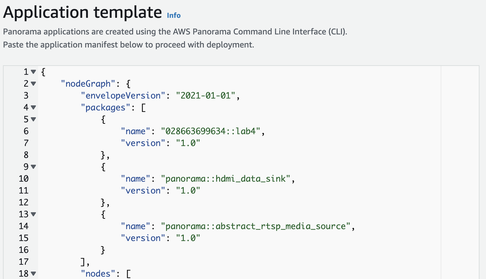

1. Input application name "Lab4" (Instead of Lab1 in the below picture), and click "Proceed to deploy" button.

    

1. "Panorama pricing" dialog appears. This is a confirmation how cost for AWS Panorama is charged. Click "Continue" button.

    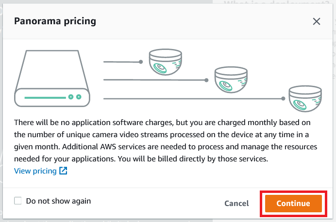
    
 > Note: A lot of the deployments are common to Lab 1. So we will be using some instructions in Lab1 here

1. Click "Begin deployment" button.

    

1. IAM Role can be empty for this application. Click "Next" button.

    

1. Click "Select device" button.

    

1. Choose your device, and click "Select" button.

    

1. Confirm the selected device, and click "Next" button.

    

1. Confirm the selected device, and click "Next" button.

    

1. Click "View input(s)" button.

    

1. Click "Select data sources" button.

    

1. Select the data source, and click "Save" button.

    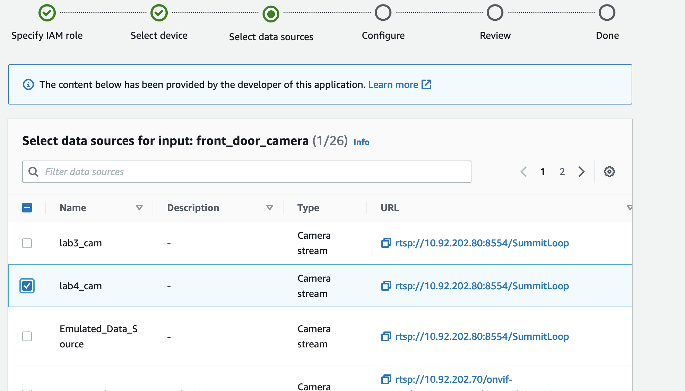

1. Confirm the selected data source, and click "Save" button.

    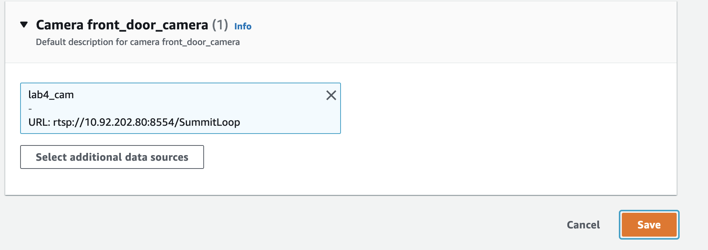

1. Click "Next" button.

    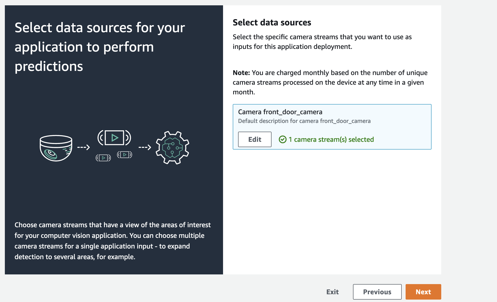

1. Click "Next" button.

    

1. Click "Deploy" button.

    

1. Deployment process starts. Click "Done" button.

    

1. You can monitor the deployment status on the application list screen.

    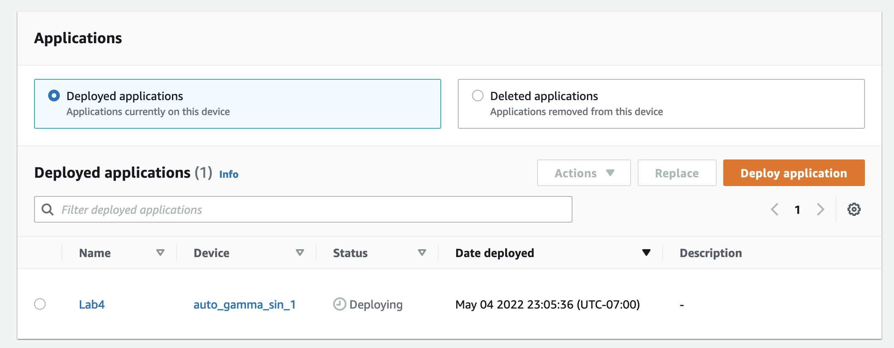

1. Wait until the status changes to "Running".

    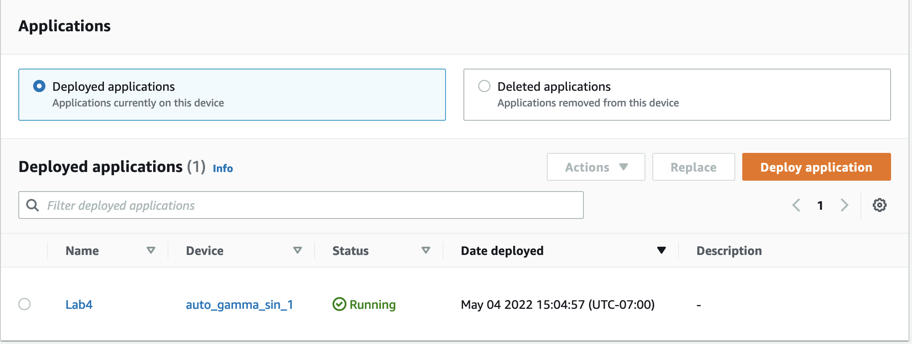

1. Check HDMI output (If HDMI display is available)

    1. Connect your HDMI display with the Panorama appliance device.
    1. Confirm that camera image and bounding boxes are visible on the display.
    
1. At this point you should see output on your screen like below. 

> Note: We used an emulated Camera stream that was streaming a video as an RTSP stream.

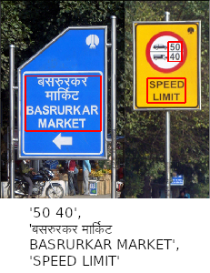

1. Check application logs on CloudWatch Logs

    1. Open https://console.aws.amazon.com/panorama/home#deployed-applications, and click the deployed application.

        

    1. Copy the application instance ID to the clipboard.

        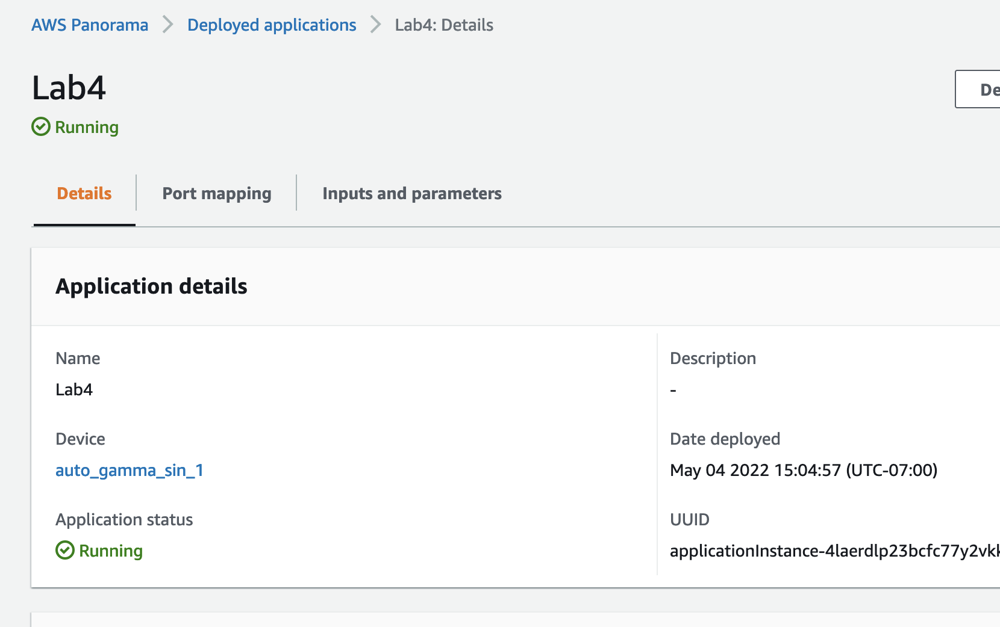

    1. Open https://console.aws.amazon.com/cloudwatch/home#logsV2:log-groups, and search for a log group which contains the application instance ID. Click it.

        
    
    1. Find a log stream "console_output", click it.

        

    1. Confirm logs from application are visible.

        

1. Delete the application.

    Once you confirmed that the application is running as expected, let's delete the application before moving to next Labs.

    1. Open https://console.aws.amazon.com/panorama/home#deployed-applications, and select the application.

        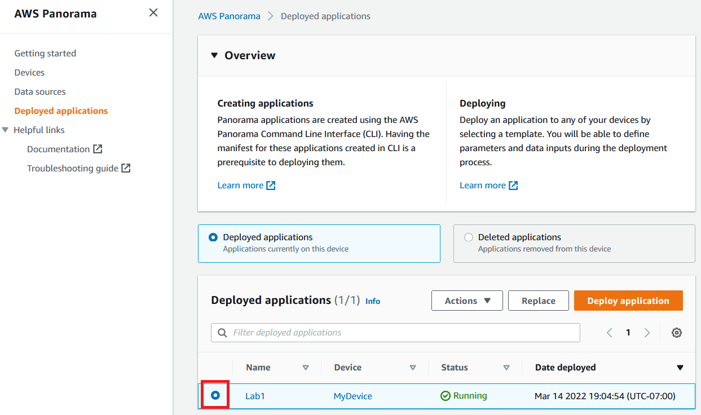

    1. From the "Actions" drop-down menu, choose "Delete from device".

        

    1. Input the application name "Lab4", and click "Delete".

        

    1. Application status changes to "Deleting".

        

    1. Wait until the application disappears from the list.

        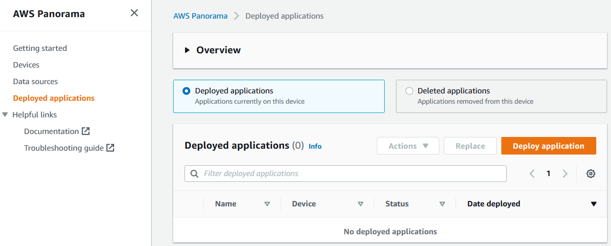

## Conclusion

By completing this Lab, you learned how to build basic AWS Panorama application step-by-step.